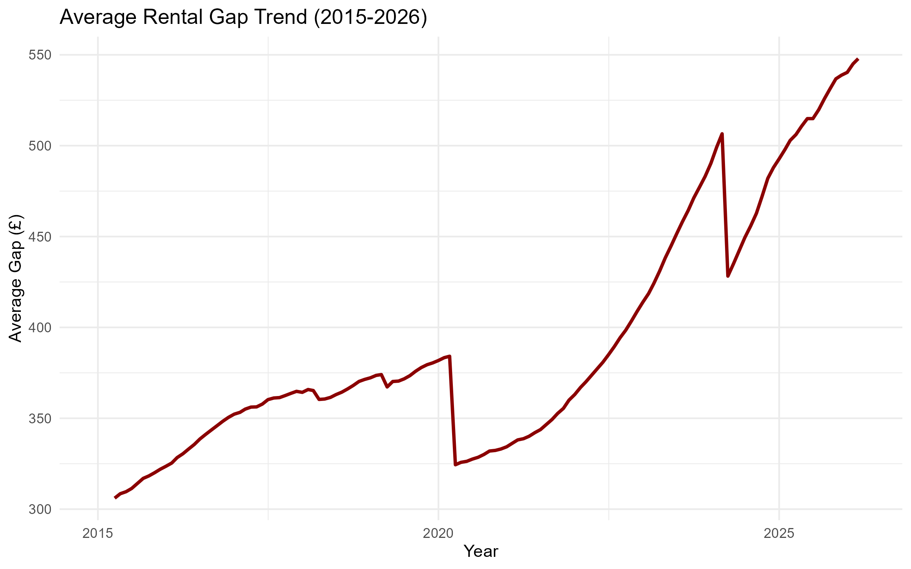
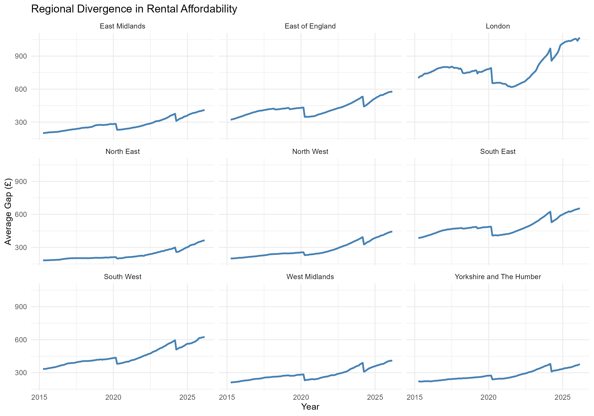

# The Local Housing Allowance Gap

**Benefit adequacy and regional divergence in the English private rental market, 2015-2026.**

A panel-data analysis of the gap between private market rents and Local Housing Allowance (LHA), the benefit that caps how much housing support a private renter can receive, across nine English regions.

> **Headline finding:** the gap between market rents and LHA has widened by an average of **£17.46 per month, every year** (SE £1.16, p < 0.001), with London diverging the fastest and furthest in absolute terms.

---

## Research Question

LHA outlines the maximum housing benefit paid toward private rents, but the rate is not automatically linked to rents. It is periodically frozen by government, even as market rents continue to rise. This project asks how the gap between LHA and actual market rents has evolved across English regions since 2015, and what its trajectory reveals about the effect of freezing a benefit rate against a moving private market rent benchmark.

## Data

Two official series were combined at England's nine Government Office Regions, the finest geography common to both sources, since ONS does not publish its private rent index at the more granular Broad Rental Market Area (BRMA) level.

| Series | Source | Detail |
|---|---|---|
| Private rents | ONS Price Index of Private Rents | Monthly, regional, one-bed category, 2015-2026 |
| LHA rates | DWP Local Housing Allowance, Category B (one-bed) | Historical file (2015-16 to 2021-22) + individual official tables (2022-23 to 2025-26) |

- 152 BRMAs were mapped to region and aggregated to an unweighted regional mean (population and housing-stock weights are not publicly available, so this is a simplified estimate rather than a precise one), then converted from weekly to monthly to match the rent series.
- Final panel: 1,224 region-month observations across 9 regions, of which 1,188 entered the estimation sample (36 fall outside the LHA series' coverage window: 27 before it begins in 2015-16, 9 after the latest available table, 2025-26).
- Scope is England only, where consistent regional geography is available in both source series.

## Method

The gap (market rent minus LHA rate) was modelled as a function of a linear time trend. Region fixed effects were included to control for permanent level differences between regions, and standard errors were clustered by region to allow for serial correlation within each region's monthly series. The model was estimated in R with the `fixest` package:

```
gap[i,t] = β · time[t] + α · region[i] + ε[i,t]   |   region fixed effects, SEs clustered by region
```

## Key Findings

| Trend coefficient | Adj. R² | Within R² | Observations | Regions (FE) |
|---|---|---|---|---|
| +£17.46/yr | 0.937 | 0.603 | 1,188 | 9 |

The trend is not smooth: the national average gap shows sharp resets in 2020 and 2024, where it suddenly narrows before widening again. This is consistent with the timing of the actual dates LHA was uprated, rather than a gradual policy response to rents.



Regional divergence is substantial: London's gap has grown fastest and furthest in absolute terms, while regions such as the North East and West Midlands show a flatter, though still widening, trajectory. This indicates that a uniform national freeze is producing very unequal real-terms effects across England.



## Repository Structure

```
housing_benefit_gap.Rproj
├── data/
│   ├── priceindexofprivaterentsukmonthlypricestatistics.xlsx
│   ├── brma_region_lookup.csv
│   ├── lha-rates-weekly-all-years-open.csv
│   ├── 2022-23_LHA_TABLES.xlsx
│   ├── 2023-24_LHA_TABLES.xlsx
│   ├── 2024-25_LHA_TABLES.xlsx
│   └── 2025-26_LHA_TABLES.xlsx
├── data-processed/
│   └── master_rental_gap_data.csv
├── outputs/
│   ├── figure1_average_gap_trend.png
│   ├── figure2_regional_divergence.png
│   └── model_summary.txt
├── 01_cleaning.R
├── 02_analysis.R
├── SA_LHA_Gap_Proj.pdf       
└── README.md
```

## Reproducing the Analysis

1. Clone the repository and open `housing_benefit_gap.Rproj` in RStudio.
2. Run `01_cleaning.R` to load, validate, and merge the ONS and DWP source files into `data-processed/master_rental_gap_data.csv`.
3. Run `02_analysis.R` to estimate the fixed-effects model and regenerate the figures and model summary in `outputs/`.

Required packages: `tidyverse`, `janitor`, `here`, `readxl`, `lubridate`, `fixest`.

## Limitations

- Regional aggregation of BRMAs is unweighted, so variation within regions is not captured.
- The analysis is descriptive of the gap's evolution rather than a causal estimate of claimant-level effects.
- Scope is limited to England, where consistent regional geography is available in both source series.

## Sources

- [ONS Price Index of Private Rents](https://www.ons.gov.uk/)
- [DWP Local Housing Allowance rates](https://www.gov.uk/government/collections/local-housing-allowance)

## Author

**Sophia Adams**: [GitHub](https://github.com/sophia-adams1)
